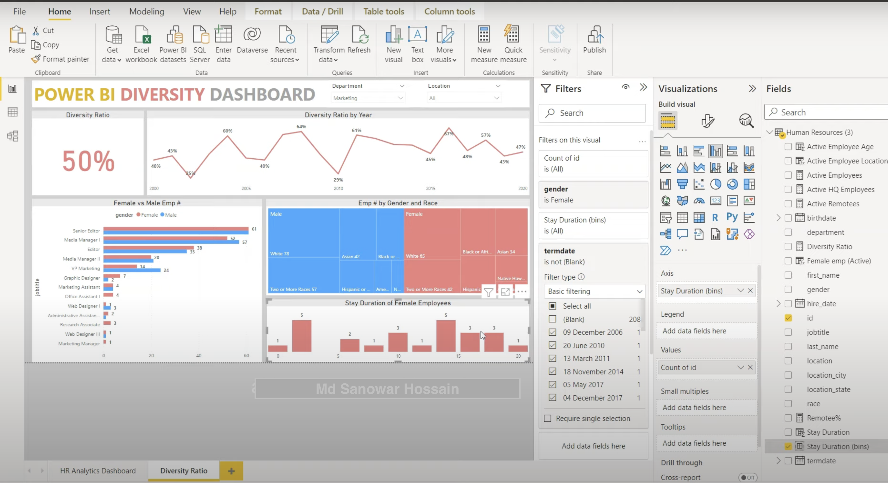
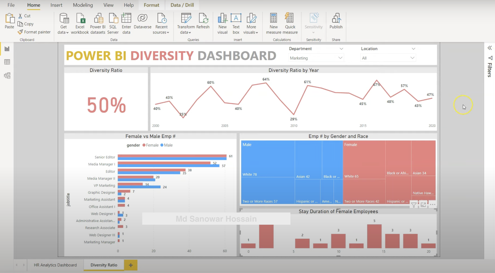

# HR-Data-Analysis-PowerBI
How to develop a data analysis dashboard in Power BI for the purpose of assessing the amount of human resources that are available inside a business. This project focuses on how to clean data, how to import data into Power BI, how to construct measures using DAX, and how to display data using a variety of data charts, filters, and slicers.  

# Data Analysis by Power BI

 
# Dashboard of Power BI

